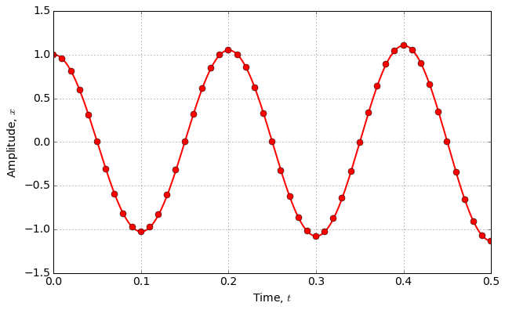
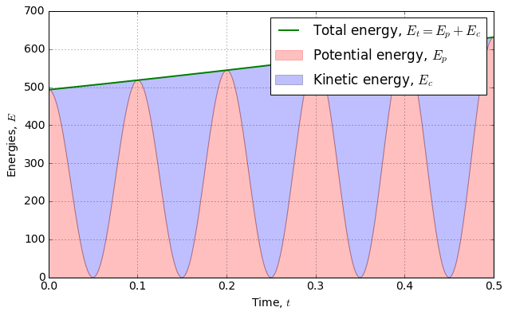
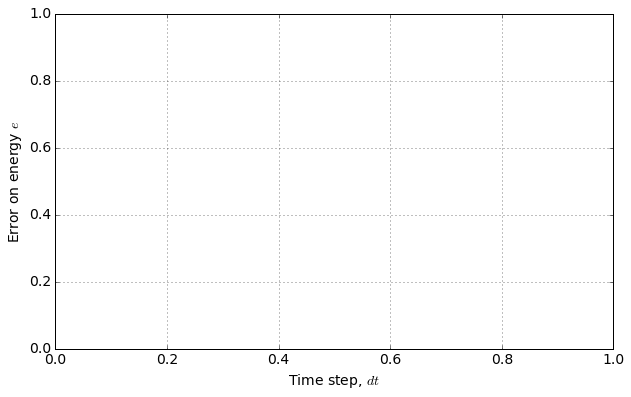

.. code:: python

    # Setup
    %matplotlib inline
    import numpy as np
    import matplotlib.pyplot as plt
    import matplotlib
    params = {'font.size'     : 14,
              'figure.figsize':(10.0, 6.0),
              'lines.linewidth': 2.,
              'lines.markersize': 8,}
    matplotlib.rcParams.update(params)

Ordinary differential equations (ODE)
=====================================

Scope
-----

-  Widely used in physics
-  Closed form solutions only in particular cases
-  Need for numerical solvers

Introductive example
--------------------

Point mass :math:`P` in free fall.

Required data:

-  gravity field :math:`\vec g = (0, -g)`,
-  Mass :math:`m`,
-  Initial position :math:`P_0 = (0, 0)`
-  Initial velocity :math:`\vec V_0 = (v_{x0}, v_{y0})`

Problem formulation:

.. math::

   \left\lbrace \begin{align*}
   \ddot x & = 0\\
   \ddot y & = -g
   \end{align*}\right.

Closed form solution
--------------------

.. math::

   \left\lbrace \begin{align*}
   x(t) &= v_{x0} t\\
   y(t) &= -g \frac{t^2}{2} + v_{y0}t 
   \end{align*}\right.

.. code:: python

    tmax = .2
    t  = np.linspace(0., tmax, 1000) 
    x0, y0   = 0., 0. 
    vx0, vy0 = 1., 1.
    g = 10.
    x = vx0 * t
    y = -g  * t**2/2. + vy0 * t
    plt.plot(x, y, label = "Exact solution")
    plt.grid()
    plt.xlabel("x")
    plt.ylabel("y")
    plt.legend()
    plt.show()

.. image:: ODE_files/ODE_4_0.png

Reformulation
-------------

Any ODEs can be reformulated as a first order system equations. Let's
assume that

.. math::

   Y = \begin{bmatrix}
   x \\
   y \\
   \dot x \\
   \dot y \\
   \end{bmatrix}

As a consequence:

.. math::

   \dot Y = \begin{bmatrix}
   \dot x \\
   \dot y \\
   \ddot x \\
   \ddot y \\
   \end{bmatrix}

Then, the initialy second order equation can be reformulated as:

.. math::

   \dot Y = f(Y, t) = 
   \begin{bmatrix}
   0 & 0 & 1 & 0\\
   0 & 0 & 0 & 1\\ 
   0 & 0 & 0 & 0\\
   0 & 0 & 0 & 0\\
   \end{bmatrix}
   Y + 
   \begin{bmatrix}
   0 \\
   0 \\
   0 \\
   -g \\
   \end{bmatrix}

Generic problem

Solving :math:`\dot Y = f(Y, t)`

Numerical integration
---------------------

-  approximate solution: need for error estimation
-  discrete time: :math:`t_0`, :math:`t_1`, :math:`\ldots`
-  time step :math:`dt = t_{i+1} - t_i`,

Euler method
------------

-  Intuitive
-  Fast
-  Slow convergence

.. math::

   Y_{n+1} = Y_n + f(Y) dt

.. code:: python

    dt = 0.02 # Pas de temps
    Y0 = np.array([0., 0., vx0, vy0])
    nt = int(tmax/dt) # Nombre de pas
    ti = np.linspace(0., nt * dt, nt)
    
    def derivate(Y, t):
      return np.array([Y[2], Y[3], 0., -g])
    
    def Euler(func, y0, t):
      dt = t[1] - t[0]
      nt = len(t)
      Y  = np.zeros([nt, len(y0)])
      Y[0] = y0
      for i in xrange(nt-1):
        Y[i+1] = Y[i] + func(Y[i], t[i]) * dt
      return Y
    
    Y_euler = Euler(derivate, Y0, ti)
    x_euler, y_euler = Y_euler[:,0], Y_euler[:,1]
    plt.plot(x, y, label = "Exact solution")
    plt.plot(x_euler, y_euler, "or", label = "Euler")
    plt.grid()
    plt.xlabel("x")
    plt.ylabel("y")
    plt.legend()
    plt.show()

.. image:: ODE_files/ODE_8_0.png

Runge Kutta 4
-------------

.. code:: python

    def RK4(func, y0, t):
      dt = t[1] - t[0]
      nt = len(t)
      Y  = np.zeros([nt, len(Y0)])
      Y[0] = y0
      for i in xrange(nt-1):
        k1 = func(Y[i], t[i])
        k2 = func(Y[i] + dt/2. * k1, t[i] + dt/2.)
        k3 = func(Y[i] + dt/2. * k2, t[i] + dt/2.)
        k4 = func(Y[i] + dt    * k3, t[i] + dt)
        Y[i+1] = Y[i] + dt / 6. * (k1 + 2. * k2 + 2. * k3 + k4)
      return Y
    
    Y_rk4 = RK4(derivate, Y0, ti)
    x_rk4, y_rk4 = Y_rk4[:,0], Y_rk4[:,1]
    plt.plot(x, y, label = "Exact solution")
    plt.plot(x_euler, y_euler, "or", label = "Euler")
    plt.plot(x_rk4, y_rk4, "gs", label = "RK4")
    plt.grid()
    plt.xlabel("x")
    plt.ylabel("y")
    plt.legend()
    plt.show()

.. image:: ODE_files/ODE_10_0.png

Using ODEint
------------

http://docs.scipy.org/doc/scipy-0.16.0/reference/generated/scipy.integrate.odeint.html

.. code:: python

    from scipy import integrate
    
    Y_odeint = integrate.odeint(derivate, Y0, ti)
    x_odeint, y_odeint = Y_odeint[:,0], Y_rk4[:,1]
    
    plt.plot(x, y, label = "Exact solution")
    plt.plot(x_euler, y_euler, "or", label = "Euler")
    plt.plot(x_rk4, y_rk4, "gs", label = "RK4")
    plt.plot(x_odeint, y_odeint, "mv", label = "ODEint")
    
    plt.grid()
    plt.xlabel("x")
    plt.ylabel("y")
    plt.legend()
    plt.show()

.. image:: ODE_files/ODE_12_0.png

Tutorial (TD)
-------------

In this example, you have to model and animate a pendulum.

1. Write the constitutive equations.
2. Reformulate the equations as a first order system of ODEs.
3. Solve the problem using Euler, RK4 and ODE integrators.
4. Compare the results.

Practical Work (TP)
-------------------

In this example, you will simulate an harmonic oscillator and compare
the numerical solution to the closed form one.

Theory
~~~~~~

Read about the theory of harmonic oscillators on
`Wikipedia <https://en.wikipedia.org/wiki/Harmonic_oscillator>`__

The canonical equation is:

.. math::

   \ddot x + 2 \zeta \omega_0 \dot x + \omega_0^2 x = \ddot x_d

Where:

-  :math:`\omega_0` is the undamped pulsation,
-  :math:`\zeta` is damping ratio,
-  :math:`\ddot x_d` is the imposed acceleration.

 Undampened oscillator
~~~~~~~~~~~~~~~~~~~~~~

First, you will focus on the case of an undamped free oscillator
(:math:`\zeta = 0`, :math:`\ddot x_d = 0`) with the following initial
conditions:

.. math::

   \left \lbrace
   \begin{split}
   x(t = 0) = 1 \\
   \dot x(t = 0) = 0
   \end{split}\right.

The closed form solution is:

.. math::

   x(t) = \cos \omega_0 t

Plot this solution for 5 periods.

Numerical solution
~~~~~~~~~~~~~~~~~~

The following code computes the numerical solution using the Euler
integrator:

.. code:: python

    import numpy as np
    from scipy.integrate import odeint
    
    class HarmonicOscillator(object):
      """
      An harmonic oscillator class
      
      * X      : initial conditions [x(0), dotx(0)]
      * omega0 : undamped pulsation
      * zeta   : damping ratio
      * ddotxd : imposed acceleration (function)
      """
      def __init__(self, X0 = [1., 0.], omega0 = 1., zeta = 0., ddotxd = lambda t: 0):
        self.X      = np.array([X0,])
        self.omega0 = omega0
        self.zeta   = zeta
        self.ddotxd = ddotxd
        self.t = np.array([0.])
      
      def derivative(self, X, t):
        omega0 = self.omega0
        zeta   = self.zeta
        ddotxd = self.ddotxd
        return np.array([ X[1],
                          ddotxd(t) - 2. * zeta * omega0 * X[1] - omega0**2 * X[0]    
                         ])  
    
      def solve(self, t, nt, solver = Euler):
        time = np.linspace(0., t, nt + 1)
        Xs = solver( self.derivative, self.X[-1], time)
        self.X = np.append(self.X[:-1], Xs,   axis = 0)
        self.t = np.append(self.t[:-1],  time, axis = 0)
      
      def x(self):
        return self.X[:,0]    
      
      def dotx(self):
        return self.X[:,1] 
      
      def Ep(self):
        """
        Massic potential energy.
        """
        omega0 = self.omega0
        return .5 * omega0**2 * self.x()**2
      
      def Ec(self):
        """
        Massic kinetic energy.
        """
        return .5 * self.dotx()**2
        
        
    
        
    t = .5
    nt = 1000
    omega0 = 2 * np.pi * 5
    o = HarmonicOscillator(omega0 = omega0)
    o.solve(t = t, nt = nt, solver = Euler)
    
    fig = plt.figure(0)
    plt.clf()
    plt.plot(o.t, o.x(), "or-", markevery = 20)
    plt.grid()
    plt.xlabel("Time, $t$")
    plt.ylabel("Amplitude, $x$")
    plt.show()

 Confrontation
^^^^^^^^^^^^^^

Plot the closed form solution along with the numerical solution. Compare
and discuss the results.

Energies
^^^^^^^^

The kinetic and potential (massic) energies of the numerical solutions
are computed in the following methods:

.. code:: python

      def Ep(self):
        """
        Massic potential energy.
        """
        omega0 = self.omega0
        return .5 * omega0**2 * self.x()**2
      
      def Ec(self):
        """
        Massic kinetic energy.
        """
        return .5 * self.dotx()**2

Use them to plot the evolution of the energies and compare the result
with the closed form solution. An example is five b

.. code:: python

    plt.fill_between(o.t, 0., o.Ep(), color = "r", alpha = .25, label = "Potential energy, $E_p$")
    plt.fill_between(o.t, o.Ep(), o.Ep() + o.Ec(), alpha = .25, label = "Kinetic energy, $E_c$")
    plt.plot(o.t, o.Ep() + o.Ec(), "g-", label = "Total energy, $E_t = E_p + E_c$")
    plt.grid()
    plt.legend()
    plt.xlabel("Time, $t$")
    plt.ylabel("Energies, $E$")
    plt.show()

Comment the results. Is it possible to use the energies as an error
indicator ?

Effect of the time step
~~~~~~~~~~~~~~~~~~~~~~~

Plot the error indicator for different values of the time step using the
Euler integrator

.. code:: python

    plt.xlabel("Time step, $dt$")
    plt.ylabel("Error on energy $e$")
    plt.grid()
    plt.show()

Effect of the intégrator
~~~~~~~~~~~~~~~~~~~~~~~~

Plot the error indicator *vs*. the computing time for Euler, RK4 and
ODEint integrators. Comment the efficiency of each integrator.

Dampened oscillator
~~~~~~~~~~~~~~~~~~~

Theory
^^^^^^

**Note:** From now on, you will use only a reliable integrator
configuration.

Create a new oscillator instance with various values of :math:`\zeta`.
Plot the position *vs.* time and comment. Is the result in good
agreement with theory.

Driven oscillator
~~~~~~~~~~~~~~~~~

Create a new oscillator instance using a driving acceleration:

.. code:: python

    fd = 4.
    omegad = 2. * np.pi * fd
    def ddotxd(t):
      """
      Driving acceleration
      """  
      return np.sin(omegad * t)

Steady state
^^^^^^^^^^^^

Simulate the evolution of the position *vs.* time. Comment the existence
of a steady state.

Steady state total energy
^^^^^^^^^^^^^^^^^^^^^^^^^

Plot the steady state total energy vs. omegad. Compare with theory.

