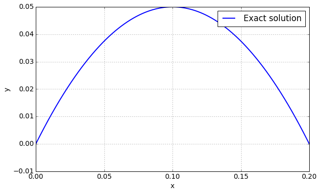
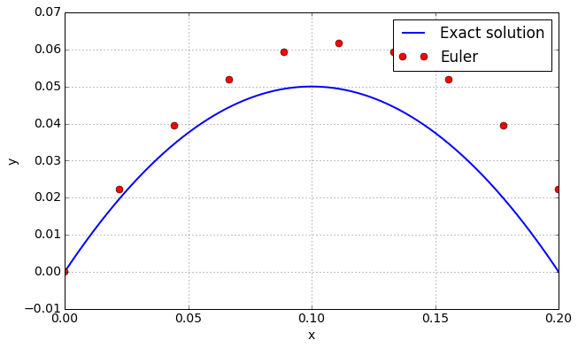
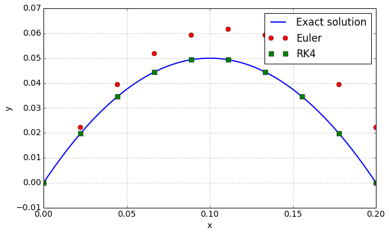
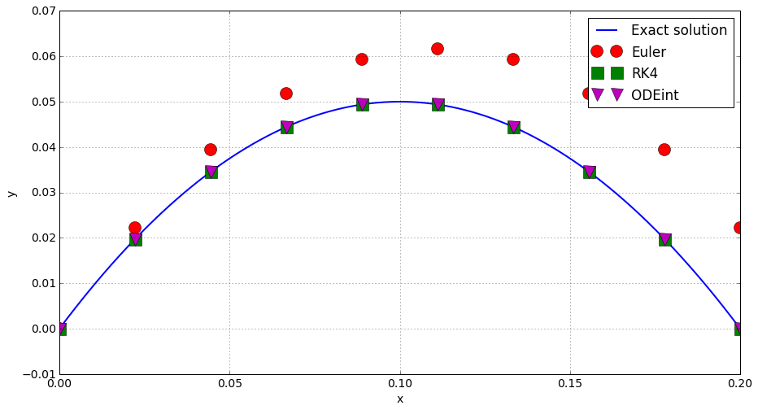

.. code:: python

    # Setup
    %matplotlib inline
    import numpy as np
    import matplotlib.pyplot as plt
    import matplotlib
    params = {'font.size'     : 14,
              'figure.figsize':(15.0, 8.0),
              'lines.linewidth': 2.,
              'lines.markersize': 15,}
    matplotlib.rcParams.update(params)

Ordinary differential equations (ODE)
=====================================

Scope
-----

-  Widely used in physics
-  Closed form solutions only in particular cases
-  Need for numerical solvers

Introductive example
--------------------

Point mass :math:`P` in free fall.

Required data:

-  gravity field :math:`\vec g = (0, -g)`,
-  Mass :math:`m`,
-  Initial position :math:`P_0 = (0, 0)`
-  Initial velocity :math:`\vec V_0 = (v_{x0}, v_{y0})`

Problem formulation:

.. math::

   \left\lbrace \begin{align*}
   \ddot x & = 0\\
   \ddot y & = -g
   \end{align*}\right.

Closed form solution
--------------------

.. math::

   \left\lbrace \begin{align*}
   x(t) &= v_{x0} t\\
   y(t) &= -g \frac{t^2}{2} + v_{y0}t 
   \end{align*}\right.

.. code:: python

    tmax = .2
    t  = np.linspace(0., tmax, 1000) 
    x0, y0   = 0., 0. 
    vx0, vy0 = 1., 1.
    g = 10.
    x = vx0 * t
    y = -g  * t**2/2. + vy0 * t
    plt.plot(x, y, label = "Exact solution")
    plt.grid()
    plt.xlabel("x")
    plt.ylabel("y")
    plt.legend()
    plt.show()

Reformulation
-------------

Any ODEs can be reformulated as a first order system equations. Let's
assume that

.. math::

   Y = \begin{bmatrix}
   x \\
   y \\
   \dot x \\
   \dot y \\
   \end{bmatrix}

As a consequence:

.. math::

   \dot Y = \begin{bmatrix}
   \dot x \\
   \dot y \\
   \ddot x \\
   \ddot y \\
   \end{bmatrix}

Then, the initialy second order equation can be reformulated as:

.. math::

   \dot Y = f(Y, t) = 
   \begin{bmatrix}
   0 & 0 & 1 & 0\\
   0 & 0 & 0 & 1\\ 
   0 & 0 & 0 & 0\\
   0 & 0 & 0 & 0\\
   \end{bmatrix}
   Y + 
   \begin{bmatrix}
   0 \\
   0 \\
   0 \\
   -g \\
   \end{bmatrix}

Generic problem

Solving :math:`\dot Y = f(Y, t)`

Numerical integration
---------------------

-  approximate solution: need for error estimation
-  discrete time: :math:`t_0`, :math:`t_1`, :math:`\ldots`
-  time step :math:`dt = t_{i+1} - t_i`,

Euler method
------------

-  Intuitive
-  Fast
-  Slow convergence

.. math::

   Y_{n+1} = Y_n + f(Y) dt

.. code:: python

    dt = 0.02 # Pas de temps
    Y0 = np.array([0., 0., vx0, vy0])
    nt = int(tmax/dt) # Nombre de pas
    ti = np.linspace(0., nt * dt, nt)
    
    def derivate(Y, t):
      return np.array([Y[2], Y[3], 0., -g])
    
    def Euler(func, y0, t):
      dt = t[1] - t[0]
      nt = len(t)
      Y  = np.zeros([nt, len(y0)])
      Y[0] = y0
      for i in xrange(nt-1):
        Y[i+1] = Y[i] + func(Y[i], t[i]) * dt
      return Y
    
    Y_euler = Euler(derivate, Y0, ti)
    x_euler, y_euler = Y_euler[:,0], Y_euler[:,1]
    plt.plot(x, y, label = "Exact solution")
    plt.plot(x_euler, y_euler, "or", label = "Euler")
    plt.grid()
    plt.xlabel("x")
    plt.ylabel("y")
    plt.legend()
    plt.show()

Runge Kutta 4
-------------

.. code:: python

    def RK4(func, y0, t):
      dt = t[1] - t[0]
      nt = len(t)
      Y  = np.zeros([nt, len(Y0)])
      Y[0] = y0
      for i in xrange(nt-1):
        k1 = func(Y[i], t[i])
        k2 = func(Y[i] + dt/2. * k1, t[i] + dt/2.)
        k3 = func(Y[i] + dt/2. * k2, t[i] + dt/2.)
        k4 = func(Y[i] + dt    * k3, t[i] + dt)
        Y[i+1] = Y[i] + dt / 6. * (k1 + 2. * k2 + 2. * k3 + k4)
      return Y
    
    Y_rk4 = RK4(derivate, Y0, ti)
    x_rk4, y_rk4 = Y_rk4[:,0], Y_rk4[:,1]
    plt.plot(x, y, label = "Exact solution")
    plt.plot(x_euler, y_euler, "or", label = "Euler")
    plt.plot(x_rk4, y_rk4, "gs", label = "RK4")
    plt.grid()
    plt.xlabel("x")
    plt.ylabel("y")
    plt.legend()
    plt.show()

Using ODEint
------------

http://docs.scipy.org/doc/scipy-0.16.0/reference/generated/scipy.integrate.odeint.html

.. code:: python

    from scipy import integrate
    
    Y_odeint = integrate.odeint(derivate, Y0, ti)
    x_odeint, y_odeint = Y_odeint[:,0], Y_rk4[:,1]
    
    plt.plot(x, y, label = "Exact solution")
    plt.plot(x_euler, y_euler, "or", label = "Euler")
    plt.plot(x_rk4, y_rk4, "gs", label = "RK4")
    plt.plot(x_odeint, y_odeint, "mv", label = "ODEint")
    
    plt.grid()
    plt.xlabel("x")
    plt.ylabel("y")
    plt.legend()
    plt.show()

Tutorial
--------

In this example, you have to model and animate a pendulum.

1. Write the constitutive equations.
2. Reformulate the equations as a first order system of ODEs.
3. Solve the problem using Euler, RK4 and ODE integrators.
4. Compare the results.
